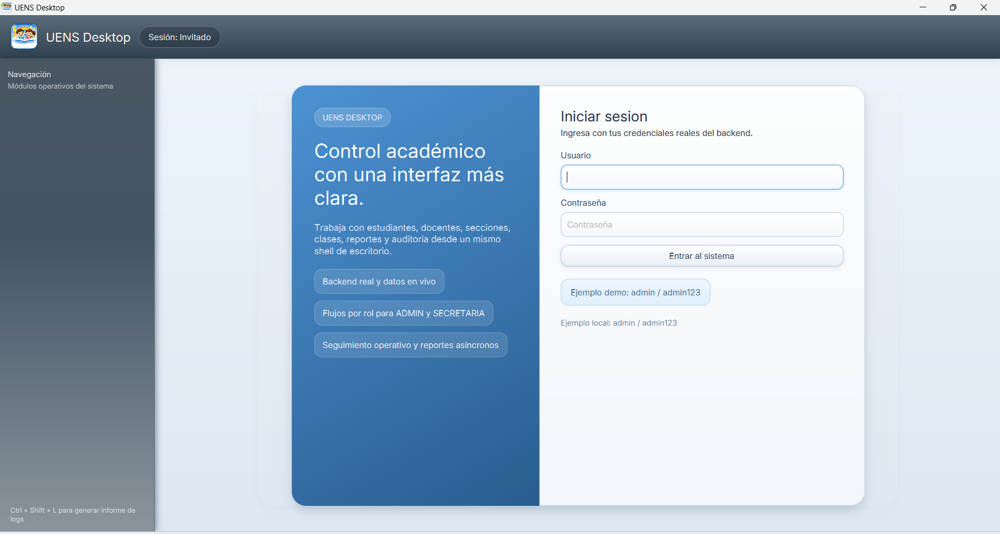
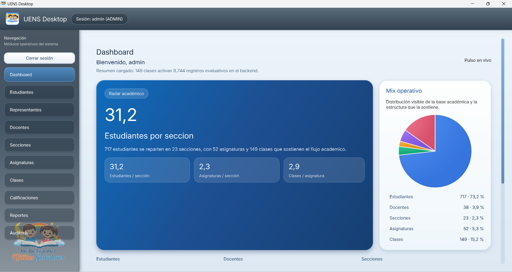
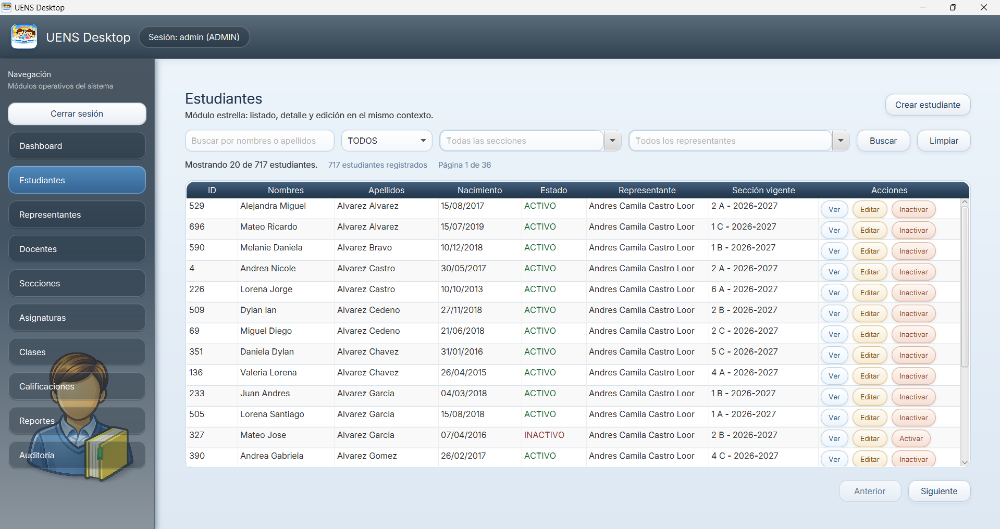
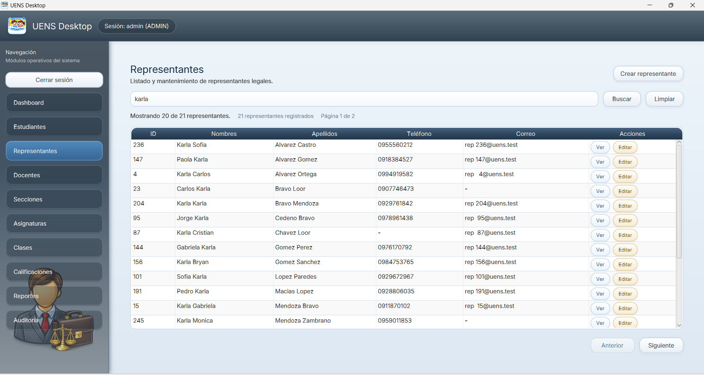
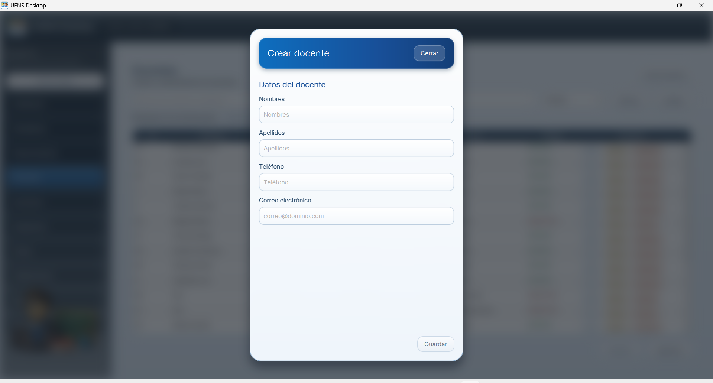
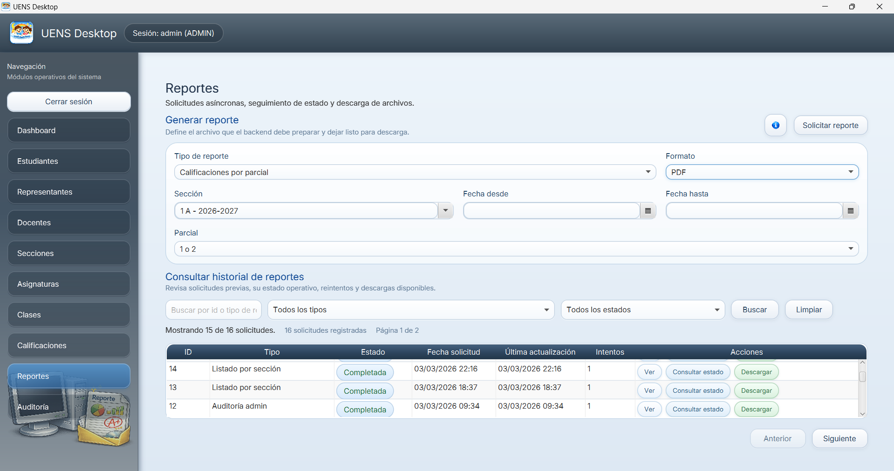
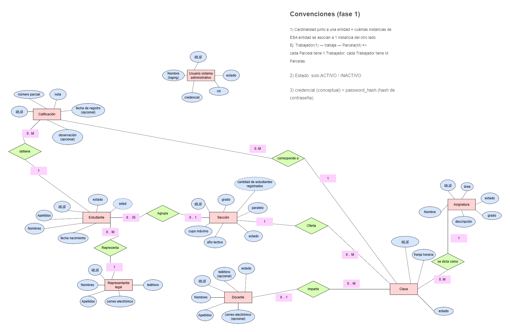

# Sistema UENS


UENS es un proyecto educativo que muestra cómo puede verse un sistema relativamente completo cuando se documenta de punta a punta: levantamiento básico de información, modelo de datos, backend, frontend desktop y operación técnica.

No es una demo aislada. Es una referencia de producto para estudiar cómo conectar negocio, datos, API y experiencia de usuario dentro de un alcance realista.

## Qué hace este repositorio

- Base de datos relacional alineada al dominio escolar.
- Backend Spring Boot modular con seguridad, trazabilidad, reportes y auditoría.
- Frontend JavaFX con módulos operativos y flujo administrativo real.
- Documentación extensa para estudio técnico y mantenimiento.

## Vista general por capa

### Base de datos

La BD sostiene entidades académicas y administrativas: estudiantes, representantes, docentes, secciones, clases, calificaciones, usuarios, reportes y auditoría.

Referencias clave:

- [Levantamiento de información](docs/01_levantamiento_informacion_negocio.md)
- [Requerimientos](docs/02_levantamiento_requerimientos.md)
- [Modelo conceptual](docs/03_modelo_conceptual_dominio.md)
- [Reglas de negocio](docs/04_reglas_negocio_y_supuestos.md)
- [Esquema SQL V2 3FN](db/V2/docs/Diagramas%20y%20query%20de%20creaci%C3%B3n/V2_3FN.sql)
- [Diccionario de datos](db/V2/docs/diccionario_de_datos_uens_v_2_3_fn.md)

### Backend

Implementado como monolito modular (Spring Boot + Java 21), con separación por módulos y capas.

Incluye:

- autenticación y sesión renovable
- seguridad y políticas base
- paginación, filtros y contrato API uniforme
- reportes asíncronos con descarga
- auditoría y trazabilidad operativa

Referencias:

- [README backend](backend/uens-backend/README.md)
- [Índice documental backend](backend/docs/backend_v_1/00_backend_v_1_indice_y_mapa_documental.md)

### Frontend desktop

Aplicación JavaFX orientada a operación escolar/administrativa: login, dashboard, CRUDs, reportes y auditoría.

Referencias:

- [README desktop](desktop/uens-desktop/README.md)
- [Índice documental frontend](desktop/docs/00_desktop_indice_y_mapa_documental.md)

## Galeria visual del producto (V1)

Estas son las capturas reales publicadas en `images/v1`.

### Login



Pantalla de autenticación del sistema. Es la entrada al flujo seguro y el inicio de sesión por rol.

### Dashboard



Vista principal tras autenticarse. Resume navegación, contexto y acceso rápido a módulos.

### CRUD Estudiantes



Módulo central de gestión de estudiantes, con listado, filtros, búsqueda y acciones operativas.

### CRUD Representantes



Gestión de representantes legales y su relación con estudiantes en el contexto administrativo.

### Crear Docente



Formulario de alta de docentes para mostrar captura de datos, validaciones y persistencia.

### Reportes



Pantalla de reportes asíncronos para solicitud, seguimiento y salida de archivos.

### Solicitar reporte de auditoría


Flujo especifico para solicitar reportes de trazabilidad administrativa.

### Auditoría


Vista de eventos auditables para control interno, soporte y análisis de operaciones.

### Instalador 1


Primera vista del instalador MSI en Windows, pensada para distribución del cliente desktop.

### Instalador 2


Segunda vista del instalador para evidenciar el flujo de instalacion y su presentacion final.

### Modelo conceptual del dominio



Diagrama de referencia del dominio para conectar análisis, datos y arquitectura.

## Documentación de apoyo

### Negocio y dominio

- [Contexto inicial](docs/00_plantilla_descripcion_empresa_y_contexto_inicial.md)
- [Levantamiento de información](docs/01_levantamiento_informacion_negocio.md)
- [Levantamiento de requerimientos](docs/02_levantamiento_requerimientos.md)
- [Modelo conceptual](docs/03_modelo_conceptual_dominio.md)
- [Reglas y supuestos](docs/04_reglas_negocio_y_supuestos.md)
- [Glosario, alcance y límites](docs/05_glosario_alcance_y_limites.md)

### Backend

- [Mapa documental backend](backend/docs/backend_v_1/00_backend_v_1_indice_y_mapa_documental.md)
- [Arquitectura general](backend/docs/backend_v_1/02_backend_v_1_arquitectura_general.md)
- [Contrato API y errores](backend/docs/backend_v_1/05_backend_v_1_diseno_api_contrato_respuestas_y_errores.md)
- [Seguridad y despliegue mínimo](backend/docs/backend_v_1/09_backend_v_1_seguridad_documentacion_y_despliegue_minimo.md)

### Frontend

- [Mapa documental frontend](desktop/docs/00_desktop_indice_y_mapa_documental.md)
- [Vision y criterios UX/UI](desktop/docs/01_desktop_vision_alcance_y_criterios_ux_ui.md)
- [Layout y navegación](desktop/docs/05_desktop_layout_shell_y_navegacion.md)
- [Cliente API y DTOs UI](desktop/docs/08_desktop_cliente_api_contratos_y_dtos_ui.md)
- [Flujo de reportes async](desktop/docs/15_desktop_flujo_reportes_async.md)

## Estructura del workspace

```text
.
├─ backend/
│  ├─ docs/
│  └─ uens-backend/
├─ db/
│  └─ V2/
├─ desktop/
│  ├─ docs/
│  └─ uens-desktop/
├─ docs/
├─ images/
│  └─ v1/
└─ pom.xml
```

## Cómo arrancarlo rápido

- Backend: [backend/uens-backend/README.md](backend/uens-backend/README.md)
- Desktop: [desktop/uens-desktop/README.md](desktop/uens-desktop/README.md)

## Configuración de secretos

Para entorno local, usa plantilla y archivo privado:

1. Copia [backend/uens-backend/.env.example](backend/uens-backend/.env.example) como `backend/uens-backend/.env`.
2. Ajusta credenciales y claves (DB, JWT, etc.) solo en tu archivo `.env` local.
3. No subas `.env` al repositorio.

En produccion, no uses archivos versionados para secretos. Deben inyectarse por variables de entorno o un gestor de secretos (vault, secret manager del proveedor cloud, etc.).

## Licencia

El workspace usa licencia copyleft fuerte: **AGPL-3.0-or-later**.

- [LICENSE raiz](LICENSE)
- [Aviso licencia DB](db/LICENSE)
- [Aviso licencia backend](backend/uens-backend/LICENSE)
- [Aviso licencia desktop](desktop/uens-desktop/LICENSE)

## Aviso

Proyecto con fines educativos y de portafolio técnico. Su valor principal es mostrar un flujo completo y documentado de construcción de producto.
